# 業務フロー

> 最終更新: 2026-03-03 ｜ サブフェーズ1で作成・更新

## 概要

人材紹介事業（エージェント業務）における、契約管理・成約計上・請求管理の3領域を対象とする。
ビジネスモデルは成功報酬型で、紹介した候補者が入社して初めて紹介手数料が発生する。
手数料率は理論年収の30〜35%が相場だが、企業ごとに基本契約で個別に定める。個別案件で契約と異なる手数料率を適用するケースもある。

組織体制は、CA（キャリアアドバイザー/候補者担当）とRA（リクルーティングアドバイザー/企業担当）が分業する「片面型」と、1人が兼務する「両面型」が混在する。分業時はRAが契約管理・成約計上を主導し、CAは候補者情報を提供する。

## アクター一覧

| アクター | 役割 | 主な業務 |
|---------|------|---------|
| RA（企業担当営業） | 企業側の窓口。基本契約の交渉・締結、成約計上の主導を担当 | 契約管理、成約計上（主導） |
| CA（候補者担当） | 候補者側の窓口。候補者の紹介、内定承諾・退職交渉の支援を担当 | 候補者情報の提供、成約計上（候補者情報の入力） |
| 営業（両面型） | CA/RAを兼務する営業担当。1人で企業側・候補者側の両方を担当 | 契約管理、成約計上 |
| 承認者 | 成約計上の承認を行う上長・管理者 | 成約計上の承認 |
| 経理 | 経理部門。請求書の発行・送付、入金確認、返戻金処理を担当 | 請求書発行・送付、入金確認、返戻金処理（マイナス請求書発行） |

> **備考**: 案件や組織規模により「片面型（CA+RA分業）」と「両面型（1人兼務）」が混在する。

## メインフロー: 契約管理 → 成約計上 → 請求管理

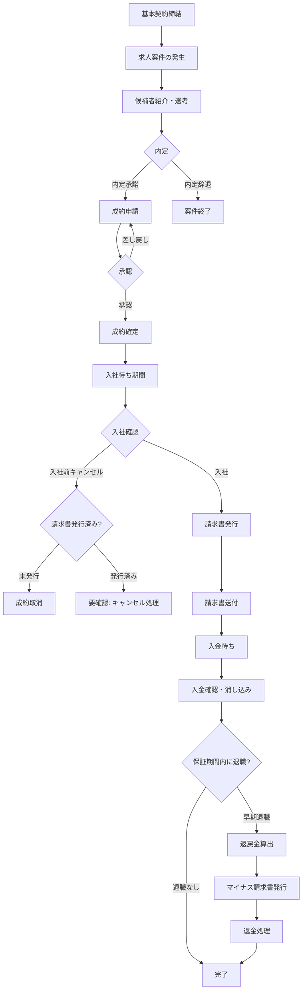

### フローの説明

| ステップ | 担当 | 内容 | 入力 | 出力 |
|---------|------|------|------|------|
| 1. 基本契約締結 | RA/営業 | 紹介先企業と基本契約を締結。手数料率・保証期間・支払条件・返戻金ルール等を定める | 企業情報、契約条件 | 基本契約書（紙 → PDF化予定） |
| 2. 成約申請 | RA/営業（主導）、CA（候補者情報提供） | 内定承諾・オファーレター・退職交渉完了が揃った時点で成約を申請。エビデンス（オファーレター等）をファイル添付 | オファーレター（理論年収の根拠）、退職交渉完了のエビデンス | 成約申請レコード |
| 3. 承認 | 承認者（上長/管理者） | 成約申請の内容を確認し、承認または差し戻し | 成約申請レコード | 承認済み成約レコード（売上見込み） |
| 4. 入社確認 | RA/営業 | 候補者が実際に入社したことを確認 | 入社日の出社確認 | 入社確認済みステータス |
| 5. 請求書発行 | 経理 | 入社確認後、自社テンプレートで請求書を作成。インボイス制度対応の適格請求書として発行 | 成約情報、基本契約の条件 | 請求書（適格請求書） |
| 6. 請求書送付 | 経理 | 企業の希望に応じた方法で送付 | 請求書、送付先情報、送付方法 | 送付済み請求書 |
| 7. 入金確認 | 経理 | 支払いサイトに基づき入金を確認。銀行明細と請求書の突合（消し込み） | 銀行入金明細、請求書情報 | 入金確認済みステータス |
| 8. 返戻金処理 | 経理 | 保証期間内の早期退職時、契約の返戻金ルールに基づき返金額を算出し、マイナス請求書を発行 | 退職情報、契約の返戻金ルール | マイナス請求書、返金処理 |

## サブフロー: 契約管理

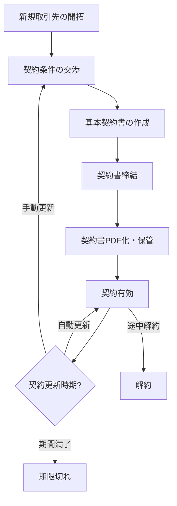

> **現状**: 紙で管理 → PDF化してシステムで管理したい
> **契約更新**: 企業により自動更新と手動更新が混在する

### 契約でシステム管理すべき主要項目

| 項目 | 説明 |
|------|------|
| 手数料率 | デフォルトの紹介手数料率（個別案件で上書き可能） |
| 支払いサイト | 請求書発行から入金までの期間（企業ごとに異なる） |
| 保証期間 | 早期退職時の返戻金が適用される期間（企業ごとに異なる） |
| 返戻金ルール | 在籍期間ごとの返金率テーブル（企業ごとに異なる） |
| 契約期間 | 契約の有効期間 |
| 更新方法 | 自動更新 or 手動更新 |
| 契約書PDF | 契約書の電子コピー |

## サブフロー: 成約計上（承認フロー付き）

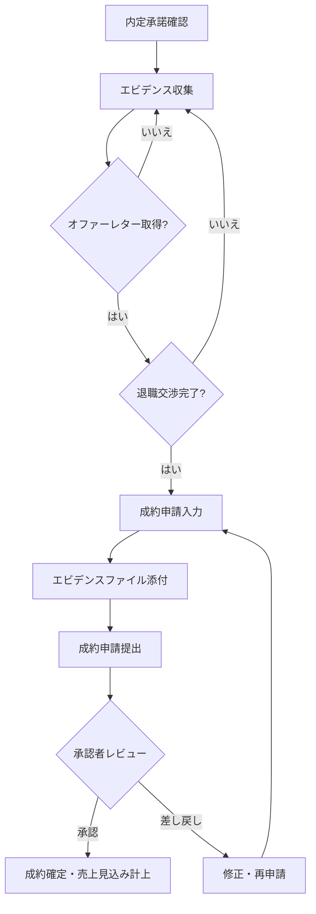

### 成約申請の記録項目

| 項目 | 説明 | 入力者 |
|------|------|--------|
| 契約先企業 | 基本契約に紐づく取引先企業 | RA/営業 |
| 候補者名 | 紹介した候補者の氏名 | RA/営業 or CA |
| 理論年収 | オファーレター記載の年収をそのまま使用 | RA/営業 |
| 適用手数料率 | 基本契約のデフォルト率。個別変更ありの場合は変更後の率 | RA/営業 |
| 手数料額 | 理論年収 × 適用手数料率（自動計算） | 自動 |
| 入社予定日 | 候補者の入社予定日 | RA/営業 or CA |
| 担当RA | 企業担当の営業（両面型の場合は本人） | 自動/RA |
| 担当CA | 候補者担当（片面型の場合のみ） | CA |
| エビデンス | オファーレター等の添付ファイル | RA/営業 |

## サブフロー: 入社前キャンセル処理

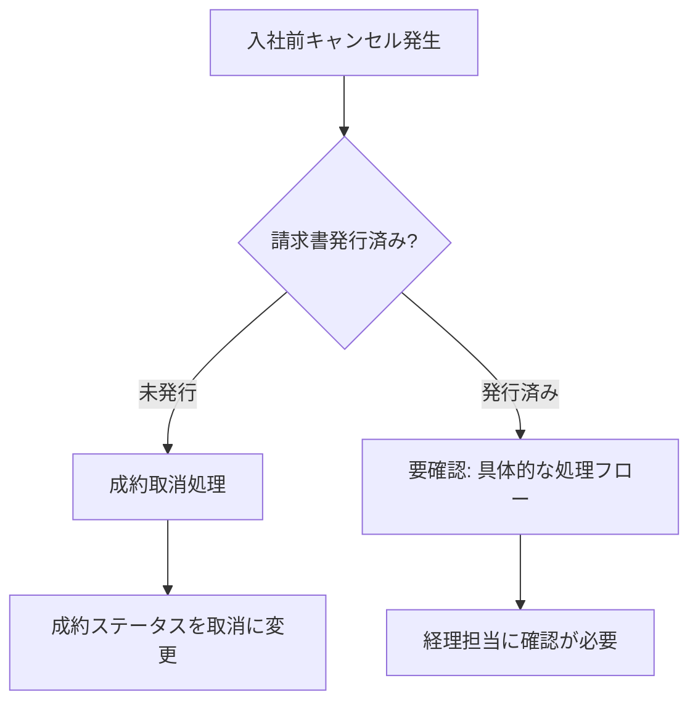

> **未確認**: 請求書発行済みの入社前キャンセルの具体的な処理フロー（U-001参照）

## サブフロー: 返戻金処理

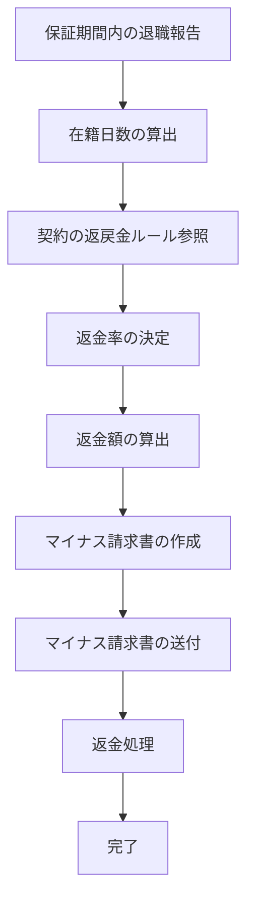

> **備考**: 返戻金はマイナス請求書（クレジットノート）として発行する。

## サブフロー: 請求書送付

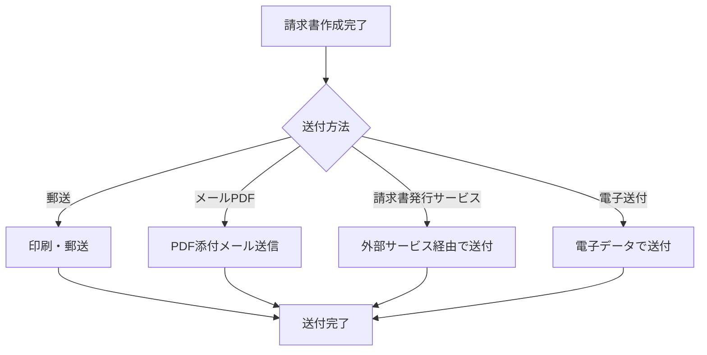

> **備考**: 送付方法は企業の希望に応じて使い分ける（郵送・メールPDF・請求書発行サービス・電子送付のすべてが存在）

## サブフロー: 例外ケース

### 入社日の延期・変更

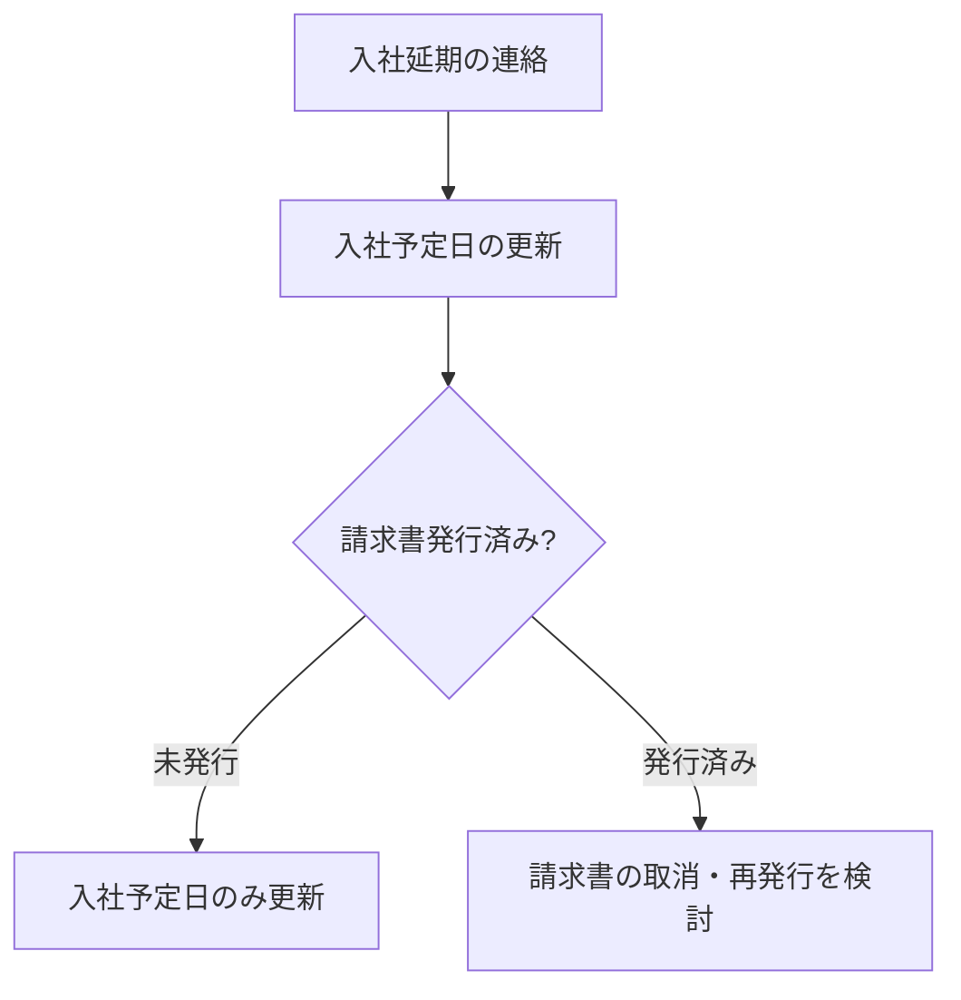

### 理論年収の変更（手数料額に影響）

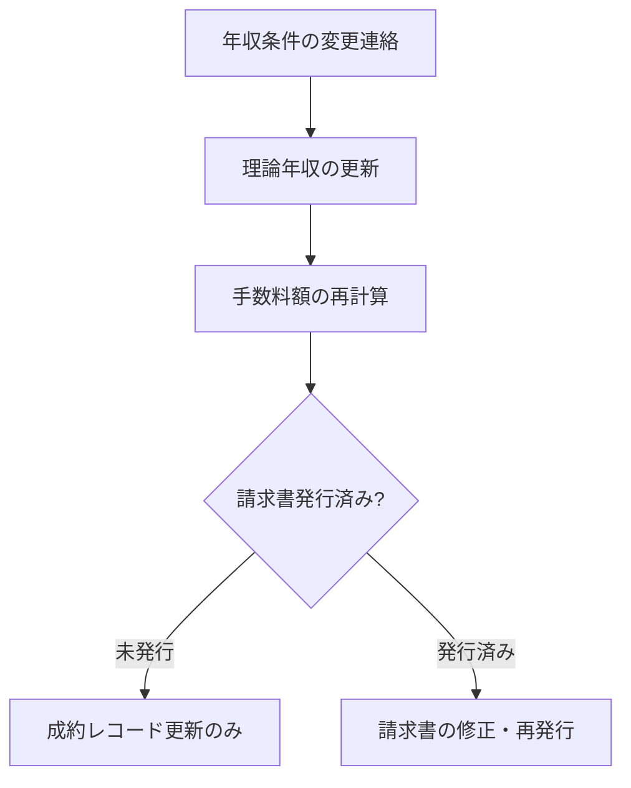

### 請求額の修正

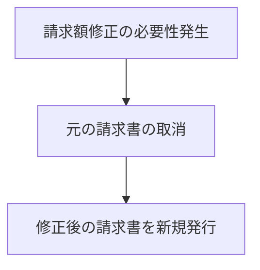

## 業務ルール

- **BR-001**: 紹介手数料率は企業ごとに基本契約で定める（相場: 理論年収の30〜35%）
- **BR-002**: 個別案件で基本契約とは異なる手数料率を適用するケースがある
- **BR-003**: 理論年収はオファーレター記載の年収をそのまま使用する
- **BR-004**: 手数料額 = 理論年収 × 適用手数料率（自動計算）
- **BR-005**: 成約計上には承認者（上長/管理者）の承認が必要
- **BR-006**: 成約計上のタイミングは、内定承諾・オファーレター・退職交渉完了がすべて揃い、承認が完了した時点
- **BR-007**: 請求書発行は入社確認後に行う（成約計上とは別タイミング）
- **BR-008**: 請求書は適格請求書（インボイス制度対応）として発行する。適格請求書発行事業者番号、税率区分等を記載
- **BR-009**: 請求書には社判（会社印）を押印する
- **BR-010**: 支払いサイトは企業ごとに基本契約で定める
- **BR-011**: 返戻金の計算ルールは企業ごとに基本契約で定める（保証期間・返金率が異なる）
- **BR-012**: 返戻金はマイナス請求書（クレジットノート）として発行する
- **BR-013**: 返戻金は毎月発生する可能性がある（頻度は低くない）
- **BR-014**: 請求書フォーマットは自社テンプレートを使用
- **BR-015**: 請求書の送付方法は企業ごとに異なる（郵送/メールPDF/請求書発行サービス/電子送付）
- **BR-016**: CA/RA分業時はRAが契約管理・成約計上を主導する
- **BR-017**: 1候補者につき1請求書を発行する（複数候補者をまとめた請求は基本なし。将来的に対応の可能性あり、優先度低）
- **BR-018**: 基本契約の更新方法は企業により自動更新と手動更新が混在する

## ステータス遷移

### 案件（紹介案件）のステータス

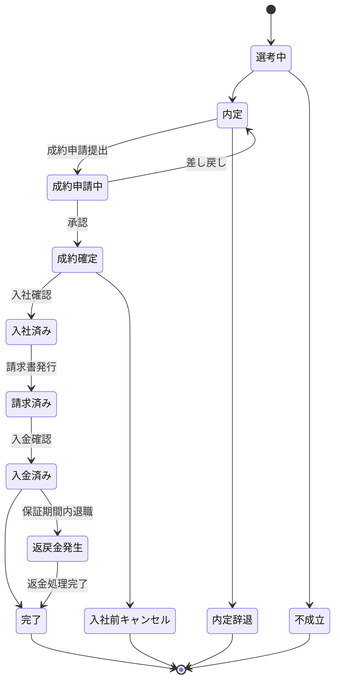

### 基本契約のステータス

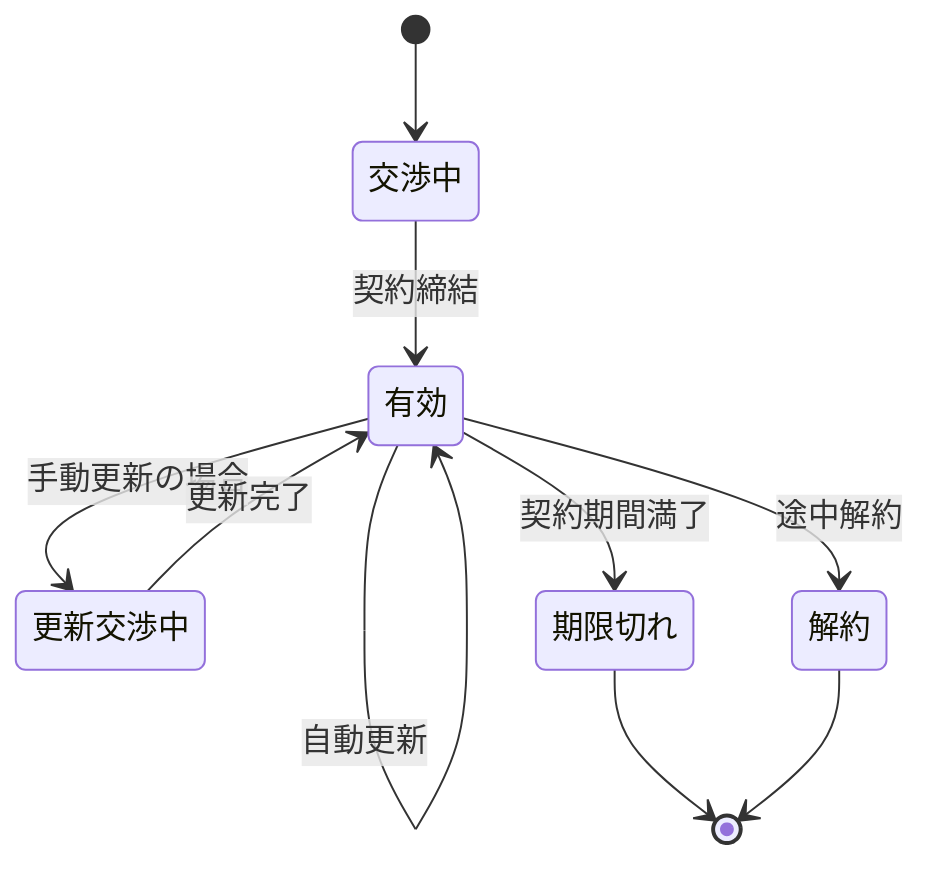

### 請求書のステータス

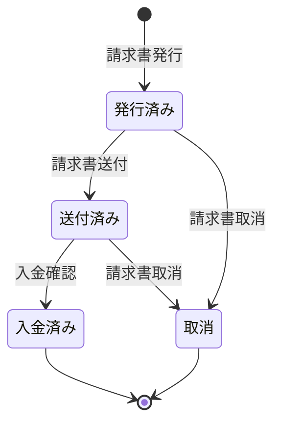
