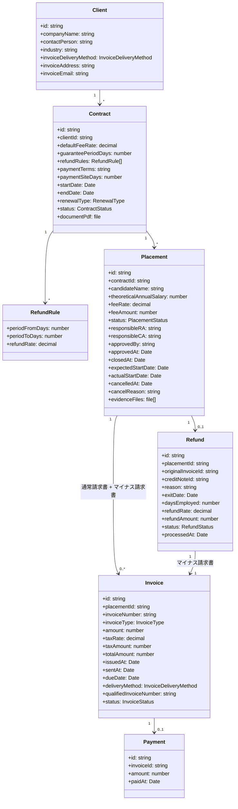
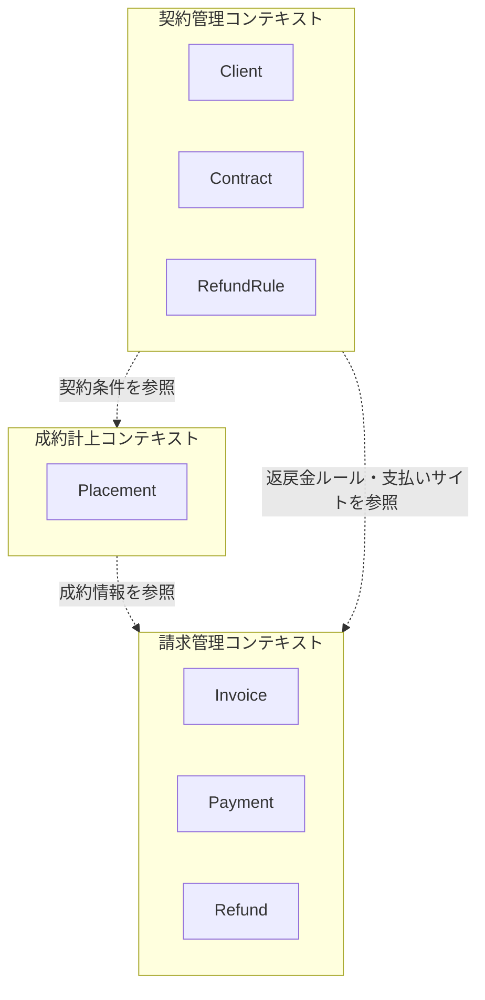

# ドメインモデル

> 最終更新: 2026-03-03 ｜ サブフェーズ1で作成、サブフェーズ2で更新

## モデル図

## エンティティ詳細

### Client（取引先企業）

- **説明**: 人材紹介の依頼元となる企業
- **主な属性**:
  - `id`: 一意識別子
  - `companyName`: 企業名
  - `contactPerson`: 担当者
  - `industry`: 業種
  - `invoiceDeliveryMethod`: 請求書送付方法（郵送/メールPDF/請求書発行サービス/電子送付）
  - `invoiceAddress`: 請求書送付先住所（郵送の場合）
  - `invoiceEmail`: 請求書送付先メールアドレス（メールPDFの場合）
- **関連**: 1つのClientに対して複数のContractが紐づく
- **備考**: 同一企業と複数回契約を結ぶ場合がある

### Contract（基本契約）

- **説明**: 取引先企業との間で締結する基本契約。手数料率・保証期間・返戻金ルール等を定める
- **主な属性**:
  - `defaultFeeRate`: デフォルト紹介手数料率（個別案件で上書き可能）
  - `guaranteePeriodDays`: 保証期間（日数。企業ごとに異なる）
  - `refundRules`: 返戻金ルール（期間ごとの返金率。企業ごとに異なる）
  - `paymentTerms`: 支払条件の説明
  - `paymentSiteDays`: 支払いサイト（日数。企業ごとに異なる）
  - `startDate`: 契約開始日
  - `endDate`: 契約終了日
  - `renewalType`: 更新方法（自動更新/手動更新）
  - `documentPdf`: 契約書PDF（紙からPDF化予定）
  - `status`: 交渉中/有効/更新交渉中/期限切れ/解約
- **関連**: 1つのContractから複数のPlacementが発生する
- **備考**: 現在紙で管理、PDF化してシステム管理に移行予定

### Placement（成約/紹介案件）

- **説明**: 候補者の紹介・内定・入社に関するレコード。成約計上の単位
- **主な属性**:
  - `candidateName`: 候補者名
  - `theoreticalAnnualSalary`: 理論年収（オファーレター記載の年収をそのまま使用）
  - `feeRate`: 適用手数料率（基本契約のdefaultFeeRateから引き継ぐが、個別に変更可能）
  - `feeAmount`: 手数料額（理論年収 × 手数料率。自動計算）
  - `status`: 選考中/内定/成約申請中/成約確定/入社済み/入社前キャンセル/内定辞退/不成立
  - `responsibleRA`: 担当RA（企業担当。両面型の場合はこのフィールドのみ使用）
  - `responsibleCA`: 担当CA（候補者担当。片面型の場合のみ使用）
  - `approvedBy`: 承認者
  - `approvedAt`: 承認日時
  - `closedAt`: 成約確定日
  - `expectedStartDate`: 入社予定日（変更の可能性あり）
  - `actualStartDate`: 実際の入社日
  - `cancelledAt`: キャンセル日（入社前キャンセルの場合）
  - `cancelReason`: キャンセル理由
  - `evidenceFiles`: エビデンスファイル（オファーレター等の添付ファイル）
- **関連**: 1つのContractに複数のPlacementが紐づく。1つのPlacementに対して、通常請求書0〜1件 + マイナス請求書0〜1件。0〜1のRefund
- **備考**: 成約申請はRA/営業が主導、承認者が承認して確定

### Invoice（請求書）

- **説明**: 入社確認後に発行される請求書。通常請求書とマイナス請求書（返戻金用クレジットノート）の2種類がある
- **主な属性**:
  - `invoiceNumber`: 請求書番号
  - `invoiceType`: 請求書種別（通常/マイナス）
  - `amount`: 請求金額（税抜。マイナス請求書の場合は負の値）
  - `taxRate`: 消費税率
  - `taxAmount`: 消費税額
  - `totalAmount`: 合計額（税込）
  - `issuedAt`: 発行日
  - `sentAt`: 送付日
  - `dueDate`: 支払期日（基本契約の支払いサイトに基づく）
  - `deliveryMethod`: 送付方法
  - `qualifiedInvoiceNumber`: 適格請求書発行事業者番号（インボイス制度対応）
  - `status`: 発行済み/送付済み/入金済み/取消
- **関連**: 1つのPlacementに対して通常0〜1のInvoice、返戻金時に追加で0〜1のマイナスInvoice
- **備考**: 自社テンプレートで発行。インボイス制度対応の適格請求書。社判（会社印）を押印。経理が担当。送付方法は企業の希望に応じる

### Payment（入金）

- **説明**: 請求書に対する入金記録
- **主な属性**:
  - `amount`: 入金額
  - `paidAt`: 入金日
- **関連**: 1つのInvoiceに対して0〜1のPayment（分割入金は基本なし、要確認）
- **備考**: 経理が銀行口座の入金明細と請求書を突合（消し込み）して確認

### Refund（返戻金）

- **説明**: 保証期間内の早期退職に伴う返金処理。マイナス請求書の発行に紐づく
- **主な属性**:
  - `reason`: 退職理由
  - `exitDate`: 退職日
  - `daysEmployed`: 在籍日数（入社日から退職日まで）
  - `refundRate`: 適用返金率（契約の返戻金ルールに基づき、在籍日数から自動決定）
  - `refundAmount`: 返金額（元の手数料額 × 返金率。自動計算）
  - `originalInvoiceId`: 元の請求書ID
  - `creditNoteId`: マイナス請求書ID
  - `status`: 未処理/処理済み
  - `processedAt`: 処理日
- **関連**: 1つのPlacementに対して0〜1のRefund。1つのRefundは元のInvoiceとマイナスInvoiceに紐づく
- **備考**: 毎月発生する可能性あり。計算ルールは企業ごとの契約による。返金額は自動計算可能

## 値オブジェクト

| 名前 | 型 | 取りうる値 | 説明 |
|------|---|-----------|------|
| ContractStatus | enum | negotiating, active, renewal_negotiating, expired, terminated | 基本契約のステータス |
| PlacementStatus | enum | screening, offered, pending_approval, closed, started, cancelled, declined, failed | 紹介案件のステータス |
| InvoiceStatus | enum | issued, sent, paid, cancelled | 請求書のステータス |
| InvoiceType | enum | normal, credit_note | 請求書種別（通常/マイナス） |
| InvoiceDeliveryMethod | enum | postal, email_pdf, invoice_service, electronic | 請求書送付方法 |
| RenewalType | enum | auto, manual | 契約更新方法 |
| RefundStatus | enum | pending, processed | 返戻金のステータス |

## 境界づけられたコンテキスト

| コンテキスト | 含まれるエンティティ | 責務 | 主な担当 |
|------------|-------------------|------|---------|
| 契約管理 | Client, Contract, RefundRule | 取引先企業との基本契約の締結・管理・PDF保管。手数料率・保証期間・返戻金ルール・支払条件の管理。契約更新（自動/手動）の管理 | RA/営業 |
| 成約計上 | Placement | 候補者紹介案件の進捗管理。成約申請→承認→確定の承認フロー。エビデンス（オファーレター等）の管理。入社日変更・年収変更への対応 | RA/営業（主導）、CA（候補者情報提供）、承認者 |
| 請求管理 | Invoice, Payment, Refund | 入社確認後の請求書発行（適格請求書/インボイス対応）・送付（複数方法）、入金確認（消し込み）、返戻金処理（マイナス請求書発行） | 経理 |
